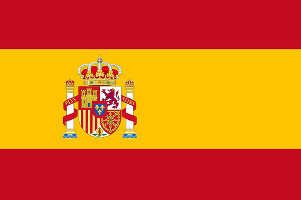
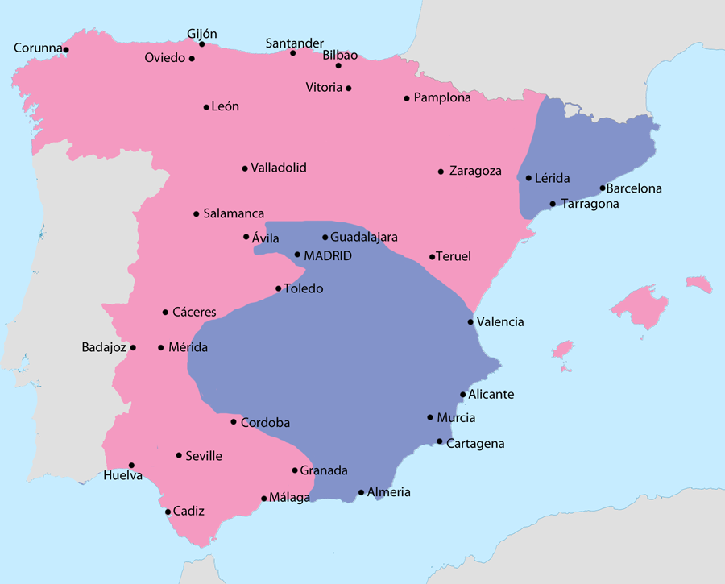
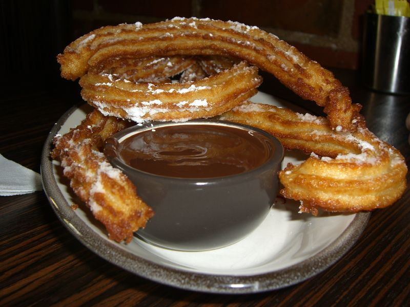

<h1>Welcome!</h1>

Have you always wanted to dip your toes into the world of Spanish language and culture but always had no idea where to start? This is the perfect website for you! This website is also ideal if you are visiting Spain (or a different Spanish speaking country) and you would like to learn some useful phrases!

<h3>Why learn Spanish?</h3>

Spanish is the 4th most widely spoken language in the world, with approximately 534 million speakers across all continents. This means that Spanish is one of the best langauges to learn for keen travellers. Exposing yourself to a whole new culture and language helps you to become a well rounded indivdual.

<h3>How to use this website?</h3>

Using the website is very simple, simply click on the topic in the navigation bar you would like to learn more about. At the start of each page you will find a lesson, followed by a game to test your knowledge. Feel free to go at your own pace, and you can always revisit one of the previous pages if you would like to revise that topic. Happy Learning!

	

  

    

      <a href="flag.png">
        
        

          
This is the flag of Spain

        

      </a>
    

  

  

    

      <a href="map.png">
        
        

          
This is a map of Spain.

        

      </a>
    

  

  

    

      <a href="churros.jpg">
        
        

          
These are churros, a popular treat in spain

        

      </a>
    

  

<!-- THIS IS THE FOOTER SECTION OF THE PAGE -->

Last updated: 6th August 2021.

